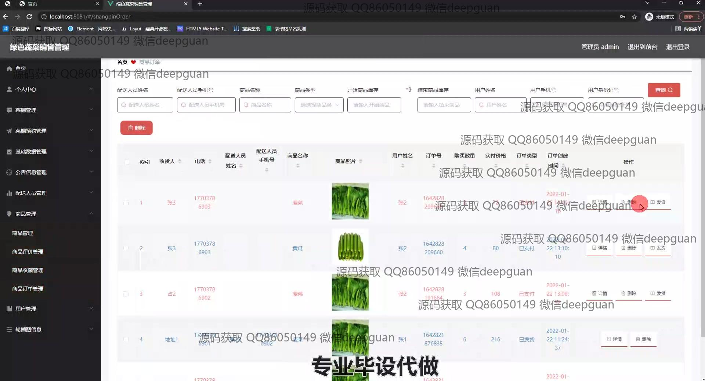

<h1 align="center">基于vue技术的绿色蔬菜销售管理系统+vue</h1>

## 简介
绿色蔬菜销售管理系统：角色分为管理员、用户；功能包括商品管理、订单管理、用户信息管理、配送员管理、菜谱分类及信息管理，实现高效后台管理与用户交互。    --计算机毕业设计源码；毕设源码；java毕业设计源码

## 联系方式

<h3 align="center">获取完整代码与数据库文件 + 微信：deepguan QQ: 86050149 QQ群: 783742310</h3>

<h3 align="center">可帮忙远程部署 包运行成功！提供远程部署、修改代码、设计文档指导、代码讲解等服务！</h3>

## 功能介绍（完整见运行截图）
管理员： 管理员具备对系统中所有模块的访问权限，包括商品管理、订单管理、用户管理、配送员管理、公告信息管理、分类管理等。可以查看和更新蔬菜商品信息、处理和查看订单详情、管理用户注册信息及权限、分配配送任务、发布和管理公告。拥有审核菜谱、商品类型管理、以及对用户信息的增删改权限。同时支持商品评价管理、设置角色权限及优化系统配置，致力于提升系统整体运作效率。 用户： 用户注册和登录后可访问系统的主导航栏，包括首页、菜谱、商品信息等。用户可通过系统浏览和筛选蔬菜商品，管理购物车并进行在线支付（模拟）。个人中心模块允许用户查看和编辑个人信息、地址管理并查询订单状态。用户还可以通过留言与管理员互动、上传头像和设置偏好，在参与商品评价的同时，提升自身购物体验。 配送员： 配送员在系统中可查看分配到的订单，管理自己的基本信息如联系方式及头像。系统提供订单详细信息查询和配送记录管理，确保高效履行配送任务并提供反馈机制。配送员也可通过与管理员的互动解决配送过程中遇到的困难。 系统管理员： 负责整个系统的维护与管理，确保系统各功能模块正常运作。进行数据备份、版本更新及服务器管理。解决用户、管理员及配送员使用过程中遇到的技术问题，保障信息安全与用户隐私。同时，系统管理员需监控系统性能，提出改进建议以优化用户体验。

## 运行截图

本代码来源于网络,仅供学习参考使用!

